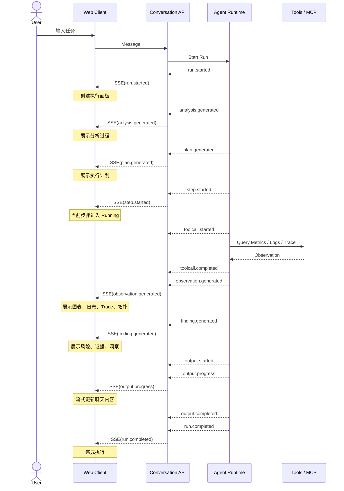

# AESP 协议规范

## 1. 协议概述

### 1.1 协议定义

Agent Execution Stream Protocol（AESP）是一套面向 Agent Runtime 的结构化流式事件协议，用于标准化描述 Agent 在任务执行过程中的分析、规划、执行、观察、发现和最终输出，实现 Agent 执行过程的实时交互、可视化展示和跨系统集成。

与传统聊天协议不同，AESP 不仅描述最终回答，还描述 Agent 的完整执行过程，包括：
* 分析过程（Analysis）
* 执行计划（Plan）
* 执行步骤（Step）
* 工具调用（ToolCall）
* 观察结果（Observation）
* 分析产物（Artifact）
* 最终输出（Output）

### 1.2 适用场景

AESP 适用于所有需要展示 Agent 执行过程的产品，例如：
* AI Anlysis
* AI RCA
* AI 巡检
* AI 数据分析
* AI Workflow

---

## 2. 设计原则

### Principle 1：结构化事件优先

协议中的所有状态变化均通过结构化事件描述，而不是自然语言文本。

### Principle 2：执行过程可观测

Agent 执行过程中的关键阶段均应产生可观测事件，支持实时展示、回放和调试。

### Principle 3：对象生命周期规范

AESP 中每个具有生命周期的对象，都应通过事件完整描述其状态变化。

对象生命周期支持 Process Object 和 State Object。
- Process Object：用于需要展示执行过程的对象。
```
started
↓
progress
↓
completed
```
- State Object：用于生命周期极短或无需展示中间状态的对象，可直接发送最终状态事件。
```
generated
```

---

## 3. 协议对象模型

### 3.1 核心对象

| 对象           | 说明              |
| ------------ | --------------- |
| Conversation | 用户会话            |
| Message      | 用户或助手消息       |
| Run          | 一次 Agent 执行     |
| Analysis     | 对任务的分析与执行策略制定       |
| Plan         | 执行计划            |
| Step         | 执行步骤            |
| ToolCall     | 工具调用            |
| Observation  | 执行过程中观察到的事实证据       |
| Finding      | 基于当前步骤的事实得出的阶段性结论 |
| Output       | 最终输出            |

Analysis、Plan 和 Step 的区别
- Analysis：回答"为什么这么做"
- Plan：回答"计划做什么"
- Step：回答"具体做什么步骤"

Observation、Finding 与 Output 的区别
- Observation：执行过程中观察到的事实，如图表、日志、Trace、拓扑及命令行输出原始结果等；
- Finding：当前 Step 基于 Observation 得出的阶段性分析结果。
- Output：汇总整个 Run 的所有 Findings 后生成的最终输出。

### 3.2 对象关系

```text
Conversation
    │
    ▼
 Message
    │
    ▼
   Run
    │
    ▼
Analysis
    │
    ▼
  Plan
    │
    ├──────────────────────────────┐
    ▼             ▼                ▼
 Step 1          ...             Step N
    │                              │
    ▼                              ▼
 ToolCall                      ToolCall
    │                              │
    ▼                              ▼
Observation                  Observation
    │                              │
    ▼                              ▼
 Finding                       Finding
    └──────────────┬───────────────┘
                   ▼
                Output
```

---

## 4. 协议交互流程

### 4.1 参与角色

| 角色               | 职责                               |
| ---------------- | -------------------------------- |
| Web Client       | 用户交互、展示执行过程                     |
| Conversation API | 管理 Conversation、Message、Run，转发事件 |
| Agent Runtime    | 执行 Agent Workflow，产生事件           |

### 4.2 时序



---

## 5. 通信协议

### 5.1 Transport

AESP 基于 **Server-Sent Events（SSE）** 传输。

```http
POST /api/conversations/{conversation_id}/messages:stream
```

响应：

```http
Content-Type: text/event-stream
```

### 5.2 Event Format

```text
event: <event_type>
id: <event_id>
data: <json>
```

### 5.3 Event Envelope

所有 AESP 事件均采用统一的 Envelope 格式，用于描述事件元信息和事件内容。

```json
{
  "id": "evt_123",
  "type": "step.started",
  "timestamp": "2026-07-06T10:01:00.000+08:00",
  "conversation_id": "conv_123",
  "run_id": "run_123",
  "sequence": 12,
  "parent_id": "",
  "metadata": {},
  "data": {}
}
```

字段说明：
| 字段                | 类型      | 必填 | 说明                                                                       |
| ----------------- | ------- | -- | ------------------------------------------------------------------------ |
| `id`              | string  | 是  | 事件唯一标识，用于事件去重、恢复和追踪。建议使用 UUID 或全局唯一 ID。                                  |
| `type`            | string  | 是  | 事件类型，采用 **`<object>.<action>`** 命名规范，例如 `step.started`、`tool.completed`。 |
| `timestamp`       | string  | 是  | 事件产生时间，采用 ISO 8601（RFC 3339）格式，例如 `2026-07-06T10:01:00.000+08:00`。       |
| `conversation_id` | string  | 是  | 当前事件所属会话（Conversation）标识，用于关联一次完整的用户对话。                                  |
| `run_id`          | string  | 是  | 当前事件所属 Agent 执行实例（Run）标识，同一次 Agent 执行产生的所有事件共享同一个 `run_id`。              |
| `sequence`        | integer | 是  | 当前 Run 内的事件顺序号，从 1 开始递增，用于保证事件顺序和断线恢复。                                   |
| `parent_id`       | string  | 否  | 父事件 ID，用于表达事件之间的关联关系，例如 `artifact.completed` 来源于某个 `observation.created`。  |
| `metadata`        | object  | 否  | 扩展元数据，例如 `agent_type`、`model`、`trace_id`、`tenant_id`、`tags` 等，不影响协议核心语义。 |
| `data`            | object  | 是  | 事件主体数据，不同 `type` 对应不同的数据结构。                                              |

---

## 6. Core Events

### Run

```text
run.started
run.progress
run.completed
run.failed
run.cancelled
```

### Plan

```text
plan.generated
```

### Step

```text
step.started
step.progress
step.completed
step.failed
step.skipped
```

### ToolCall

```text
toolcall.started
toolcall.progress
toolcall.completed
toolcall.failed
```

### Observation

```
observation.generated
```

Observation 当前 Step 观察到的事实，可直接展示，如图表、日志、Trace、拓扑等。

Observation Types支持 markdown、string、json、yaml、chart、table、log、trace、topology、dashboard、code、image、file 等格式。

示例：
```json
{
  "type": "observation.generated",
  "data": {
    "id": "obs_cpu",
    "observation_type": "chart",
    "title": "CPU Usage",
    "summary": "最近30分钟CPU变化",
    "content": { ... },
    "result_ref": { ... }
  }
}
```

备注：content 与 result_ref 至少存在一个。

### Finding

```
Finding.generated
```

Finding 基于当前 Step 的 Observation 得出的阶段性发现，用于记录当前步骤的分析结果，并作为后续 Step 或最终 Output 的输入。

支持以下类型：：
| Finding Categories  | 说明         | 示例                     |
| ------------- | ----------- |------------------------- |
| `fact`        | 客观事实归纳  | "发现 2 个节点 CPU 持续超过 85%"          |
| `anomaly`     | 异常发现     | "Consumer Lag 在 10:02 开始快速上升"           |
| `risk`        | 潜在风险     | "当前节点资源不足，存在调度失败风险"             |
| `issue`       | 已确认问题   | "BookKeeper Read Timeout"      |
| `hypothesis`  | 待验证假设   | "怀疑 Bookie IO 抖动导致 Broker Fetch 变慢"    |
| `correlation` | 关联关系    | "CPU 上升与 Pod 重启时间高度一致"             |

示例：
```json
{
  "type": "finding.generated",
  "data": {
    "id": "finding_cpu_001",
    "category": "risk",
    "title": "CPU Usage High",
    "analysis": "发现 2 个节点 CPU 使用率持续超过 85%。",
    "source_observation_ids": [
      "obs_cpu"
    ]
  }
}
```

### Output

```text
output.started
output.progress
output.completed
```

Output 表示 Agent 汇总整个 Run 的执行结果后，面向用户生成的最终交付内容。

---

## 7. Object Lifecycle

| Object      | Lifecycle                   |
| ----------- | --------------------------- |
| Run         | started → completed         |
| Analysis    | generated                   |
| Plan        | generated                      |
| Step        | started → progress → completed |
| ToolCall    | started → completed         |
| Observation | generated                   |
| Finding     | generated                   |
| Output      | started → progress → completed |

---

## 8. Protocol Message Example

下面以 **Kubernetes 集群巡检** 为例，展示一次完整的 AESP 消息流。

用户输入：
```text
帮我巡检 prod 集群是否存在风险。
```

1. Run 创建
```json
{
  "id": "evt_001",
  "type": "run.started",
  "timestamp": "2026-07-06T10:00:00Z",
  "conversation_id": "conv_001",
  "run_id": "run_001",
  "sequence": 1,
  "data": {
    "agent": "k8s-inspection"
  }
}
```

2. Analysis
```json
{
  "id": "evt_002",
  "type": "analysis.generated",
  "run_id": "run_001",
  "sequence": 2,
  "data": {
    "content": "识别到当前任务为 Kubernetes 集群巡检，将检查节点状态、资源水位和异常事件。"
  }
}
```

3. 生成执行计划
```json
{
  "id": "evt_003",
  "type": "plan.generated",
  "run_id": "run_001",
  "sequence": 3,
  "data": {
    "title": "Kubernetes Cluster Inspection",
    "steps": [
      {
        "id": "step_nodes",
        "title": "检查节点状态"
      },
      {
        "id": "step_resources",
        "title": "检查资源水位"
      },
      {
        "id": "step_events",
        "title": "检查异常事件"
      }
    ]
  }
}
```

4. 开始执行第一个步骤
```json
{
  "id": "evt_004",
  "type": "step.started",
  "run_id": "run_001",
  "sequence": 4,
  "data": {
    "step_id": "step_nodes",
    "title": "检查节点状态"
  }
}
```

```json
{
  "id": "evt_005",
  "type": "toolcall.started",
  "run_id": "run_001",
  "sequence": 5,
  "data": {
    "tool": "list_nodes"
  }
}
```

```json
{
  "id": "evt_006",
  "type": "toolcall.completed",
  "run_id": "run_001",
  "sequence": 6,
  "data": {
    "tool": "list_nodes",
    "duration_ms": 182
  }
}
```

```json
{
  "id": "evt_007",
  "type": "observation.generated",
  "run_id": "run_001",
  "sequence": 7,
  "data": {
    "id": "obs_nodes",
    "type": "table",
    "title": "Node Status",
    "content": {
      "columns": ["Node", "Status"],
      "rows": [
        ["node-prod-01", "Ready"],
        ["node-prod-02", "Ready"],
        ["node-prod-03", "SchedulingDisabled"]
      ]
    }
  }
}
```

```json
{
  "id": "evt_008",
  "type": "finding.generated",
  "run_id": "run_001",
  "sequence": 8,
  "data": {
    "id": "finding_nodes",
    "category": "issue",
    "title": "发现不可调度节点",
    "content": "发现 **1 个节点** 处于 SchedulingDisabled，建议后续检查节点维护状态或资源压力。",
    "source_observation_ids": [
      "obs_nodes"
    ]
  }
}
```

```json
{
  "id": "evt_09",
  "type": "step.completed",
  "run_id": "run_001",
  "sequence": 9,
  "data": {
    "step_id": "step_nodes",
    "summary": "节点检查完成。"
  }
}
```

5. 开始执行第二个步骤

```
...
```

6. 开始生成最终回答
```json
{
  "id": "evt_016",
  "type": "output.started",
  "run_id": "run_001",
  "sequence": 16,
  "data": {
    "format": "markdown"
  }
}
```

```json
{
  "id": "evt_017",
  "type": "output.delta",
  "run_id": "run_001",
  "sequence": 17,
  "data": {
    "format": "markdown",
    "content": "巡检完成，共发现 "
  }
}
```

```json
{
  "id": "evt_018",
  "type": "output.delta",
  "run_id": "run_001",
  "sequence": 18,
  "data": {
    "format": "markdown",
    "content": "2 个风险项，其中 1 个高风险。"
  }
}
```

```json
{
  "id": "evt_019",
  "type": "output.completed",
  "run_id": "run_001",
  "sequence": 19,
  "data": {
    "format": "markdown",
    "content": "## 巡检结果\n\n本次巡检共发现 **2 个风险项**，其中 **1 个高风险**。建议优先处理 CPU 水位过高问题。",
    "source_finding_ids": [
      "finding_nodes",
      "finding_cpu"
    ]
  }
}
```

7. 执行完成

```json
{
  "id": "evt_020",
  "type": "run.completed",
  "run_id": "run_001",
  "sequence": 20,
  "data": {
    "duration_ms": 4287
  }
}
```

