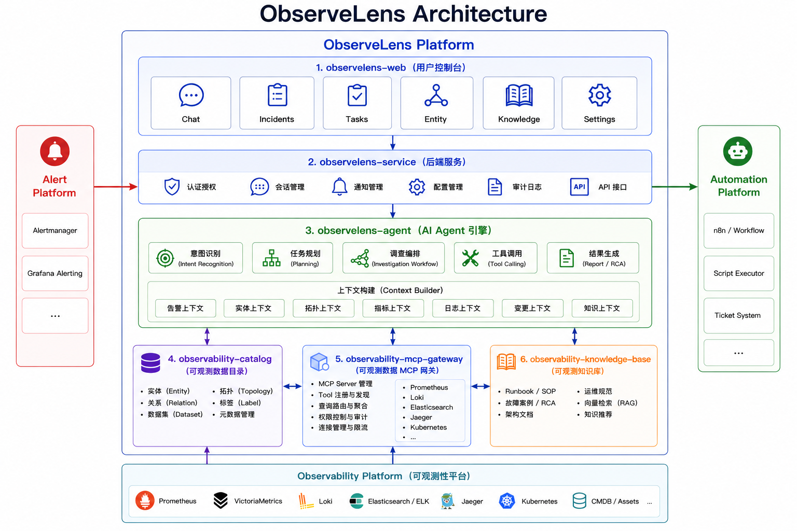

# ObserveLens Architecture

## 架构图

## 组件列表

| 组件                               | 说明                                                                                                                                    |
| -------------------------------- | ------------------------------------------------------------------------------------------------------------------------------------- |
| **observelens-web**              | ObserveLens 用户控制台前端项目，提供 AI 对话、故障调查、RCA 分析、可观测数据浏览、知识检索、系统配置等 Web UI。                                                                 |
| **observelens-service**          | ObserveLens 后端服务，负责用户认证、会话管理、Agent 调用编排、流式响应（SSE）、系统配置、通知管理及对外 REST API，为 Web 提供统一业务服务入口。                                             |
| **observelens-agent**            | ObserveLens AI Agent Runtime，负责用户意图识别、任务规划（Planning）、调查流程（Investigation Workflow）、工具调用（Tool Calling）、上下文构建、RCA 分析及最终结果生成，是产品核心智能引擎。   |
| **observability-catalog-mock**   | 可观测数据目录（Observability Catalog）Mock 服务，提供实体（Entity）、关系（Relation）、数据集（Dataset）等元数据模拟能力，用于开发、联调及演示环境。后续可替换为正式的 Observability Catalog 服务。 |
| **observability-mcp-gateway**    | 可观测数据 MCP Gateway，统一封装 Prometheus、Loki、Jaeger、Kubernetes、CMDB 等数据源，对外提供标准 MCP Tool 接口，实现可观测数据统一访问、查询路由及权限隔离。                          |
| **observability-knowledge-base** | 可观测知识库服务，负责运维文档、Runbook、SOP、故障案例、架构文档等知识的采集、索引、向量化及检索，为 Agent 提供 RAG（Retrieval-Augmented Generation）知识增强能力。                           |

