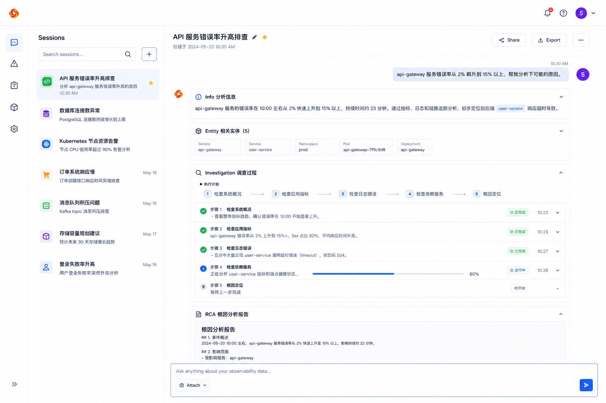
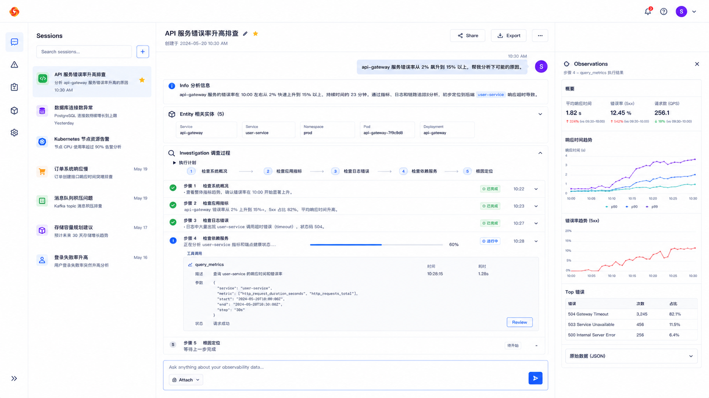
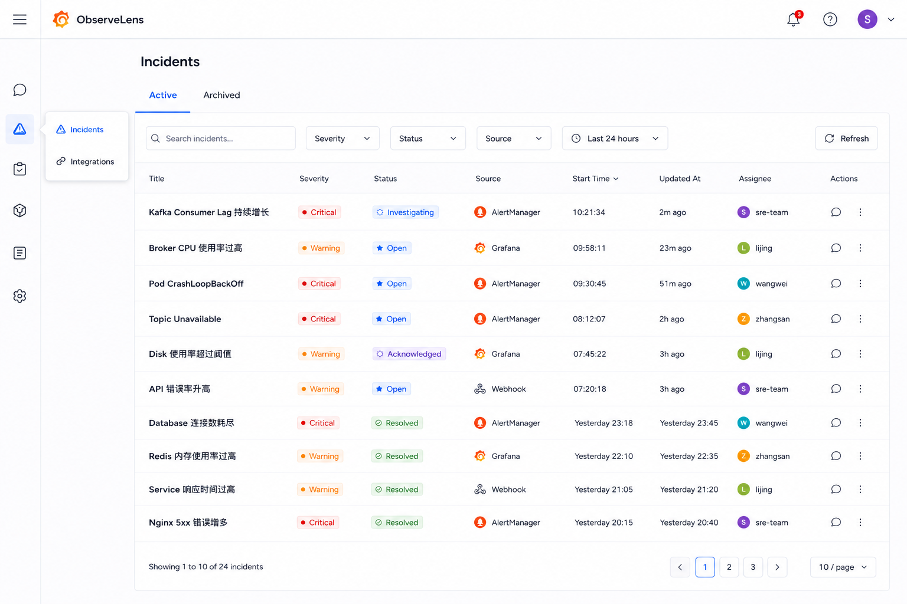
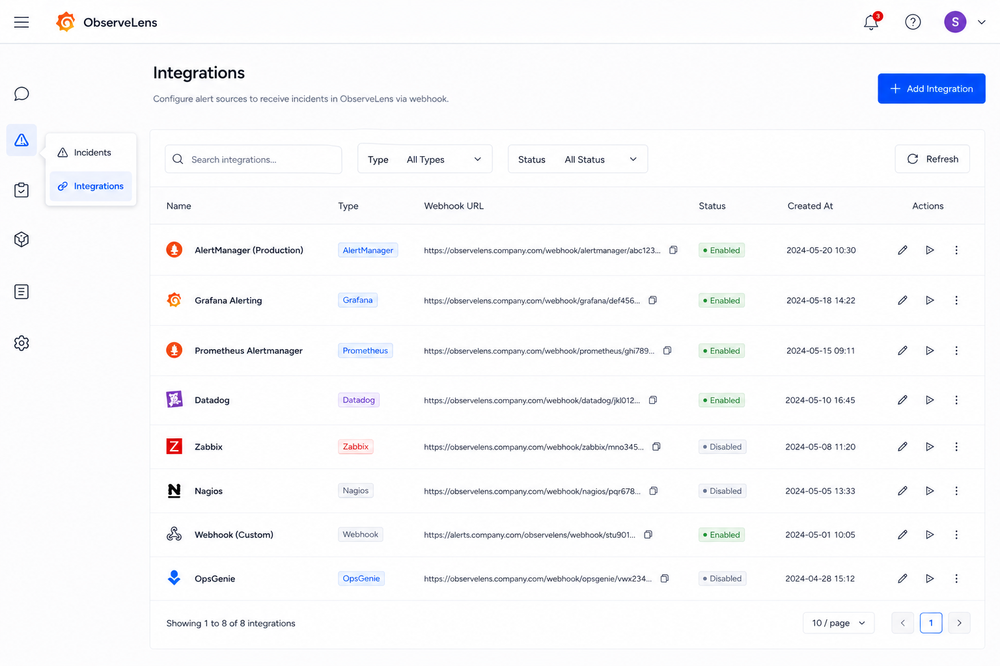
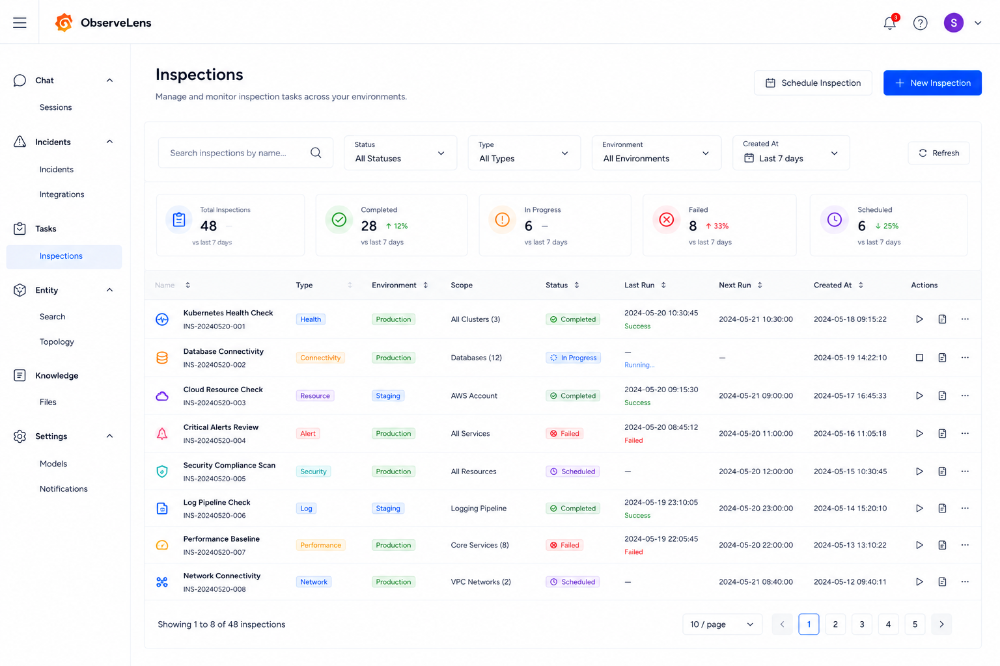
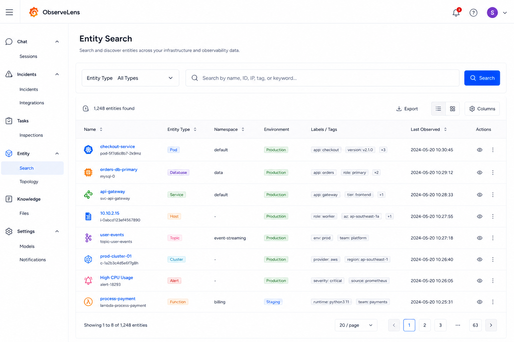
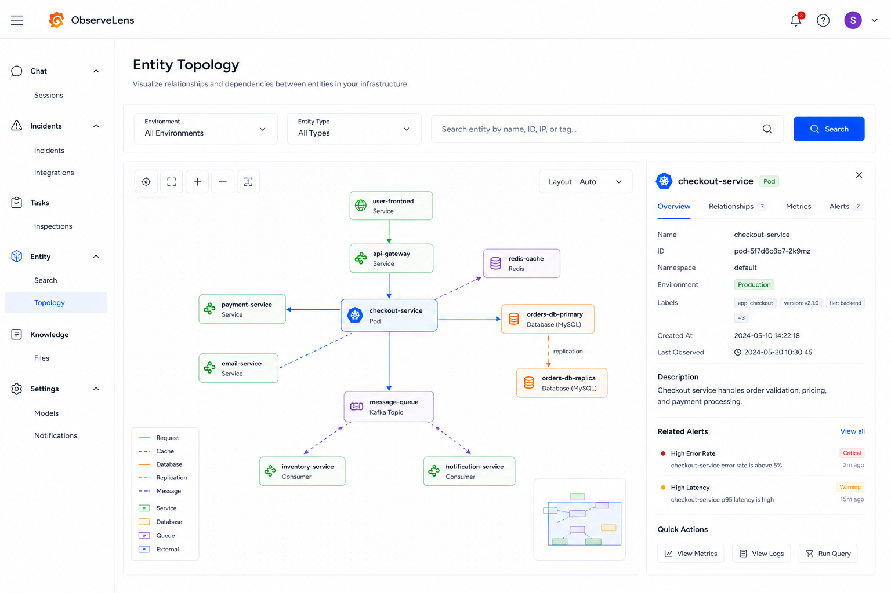
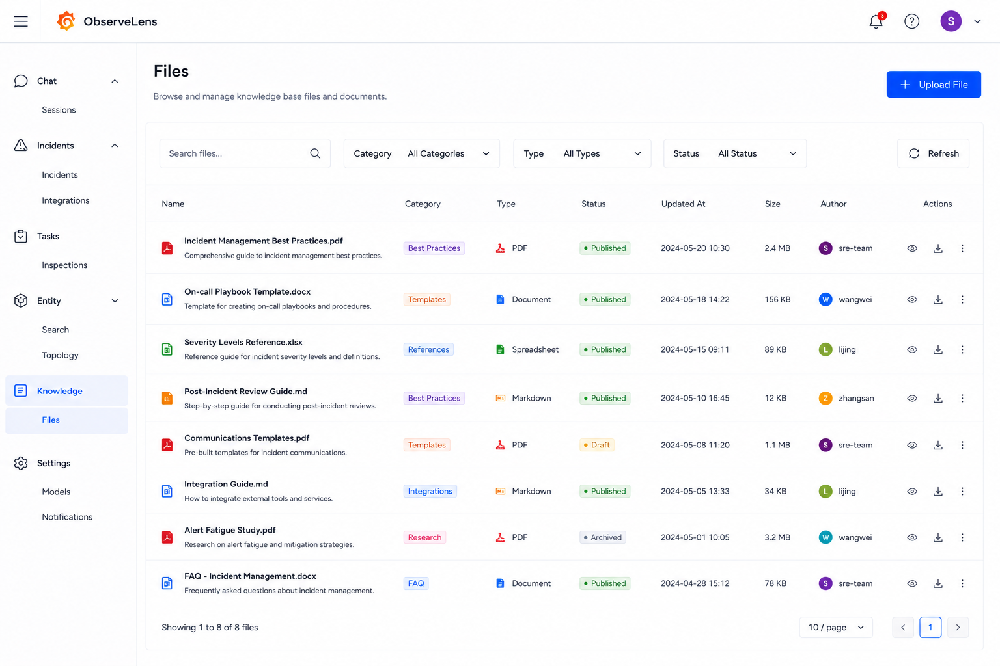
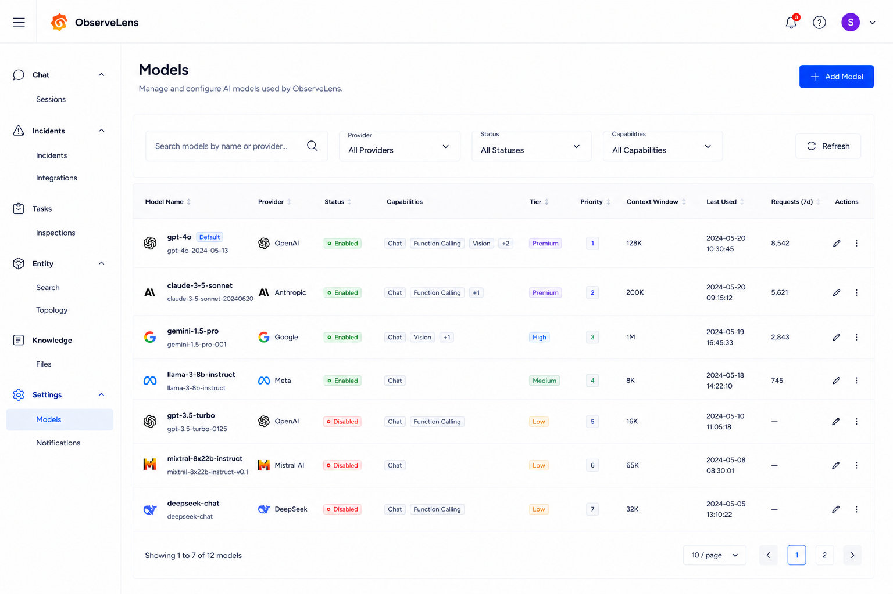
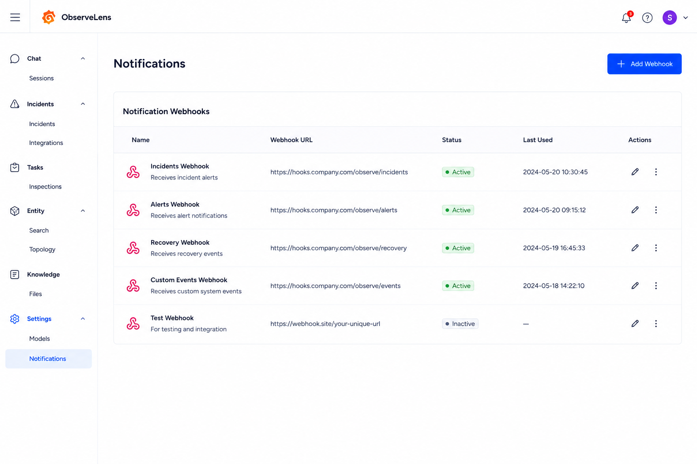

# ObserveLens UX Design

## Chat

### Chat/Sessions

---

## Incidents

### Incidents/Incidents

### Incidents/Integrations

---

## Tasks

### Tasks/Inspections

---

## Entity

### Entity/Search

### Entity/Topology

---

## Knowledge

### Knowledge/Files

---

## Setting

### Setting/Models

### Setting/Notifiactions

